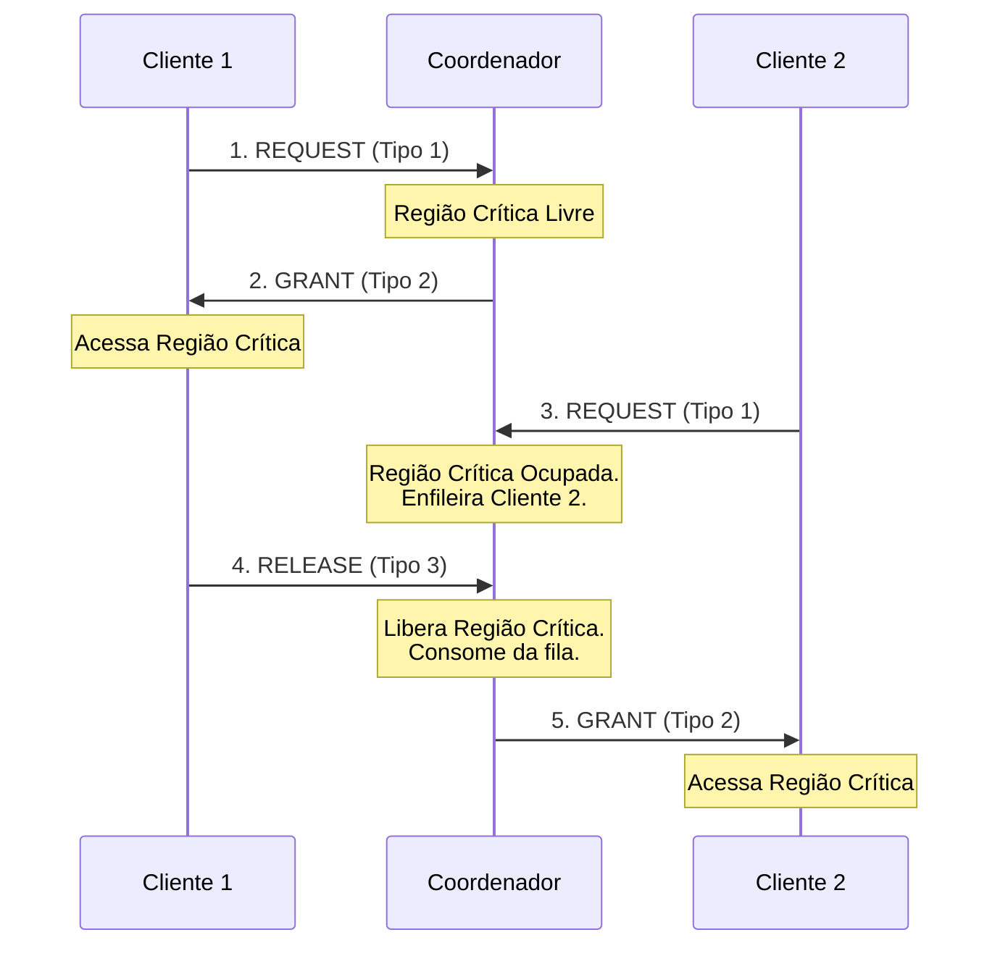

# Documentação do Projeto: Algoritmo de Exclusão Mútua Centralizada

Este documento apresenta as especificações funcionais e técnicas, decisões de projeto, detalhes de implementação e casos de uso do sistema de **Exclusão Mútua Centralizada** desenvolvido em Python.

---

## 1. Visão Geral Funcional

Em sistemas distribuídos, a **exclusão mútua** garante que múltiplos processos não acessem simultaneamente um recurso compartilhado (denominado **Região Crítica** ou **RC**), evitando inconsistências de dados e condições de corrida.

Este projeto implementa uma abordagem **centralizada**, na qual um processo especial chamado **Coordenador** gerencia o acesso à Região Crítica. Os demais processos atuam como **Clientes** que solicitam permissão para entrar na RC.

### Fluxo de Mensagens
O protocolo é composto por 3 tipos de mensagens estruturadas:
1. **REQUEST (Tipo 1)**: Enviada por um Cliente ao Coordenador para solicitar acesso à Região Crítica.
2. **GRANT (Tipo 2)**: Enviada pelo Coordenador ao Cliente no topo da fila, concedendo acesso à Região Crítica.
3. **RELEASE (Tipo 3)**: Enviada pelo Cliente ao Coordenador para liberar a Região Crítica após concluir seu processamento.



---

## 2. Especificações Técnicas e Decisões de Projeto

### 2.1. Protocolo de Rede (Sockets e Mensagem de Tamanho Fixo)
Para garantir que as leituras de rede no socket sejam determinísticas e evitar problemas de fragmentação de pacotes de dados TCP (*Nagle's algorithm* ou buffers contínuos), definimos uma mensagem de **tamanho fixo de 16 bytes**:
- **Formato**: `TIPO|ID_PROCESSO|ZEROS_DE_PREENCHIMENTO`
- **Delimitador**: caractere pipe (`|`).
- **Decisão**: O uso de preenchimento (`0` à direita) permite ler exatamente `16 bytes` (`conn.recv(16)`) de forma síncrona/bloqueante sem a necessidade de parsing complexo de streams.
- **Implementação**: Localizada em [protocol.py](file:///Users/joaomachado/Projetos/ExclusaoMutuaSD/mutex_centralizado/protocol.py).

### 2.2. Concorrência Segura (Thread-Safety) no Coordenador
O Coordenador utiliza threads separadas para tratar atividades simultâneas:
1. **Thread de Rede**: Escuta e aceita conexões TCP, delegando cada cliente a uma thread dedicada (`handle_client`).
2. **Thread do Algoritmo**: Processa a fila de requisições de forma assíncrona.
3. **Thread de Interface (UI)**: Gerencia o terminal para controle administrativo.

#### Sincronização e Variáveis de Condição
Para proteger as estruturas em memória (Fila de Requisições, Tabela de Conexões e Contadores), implementamos travas independentes em [coordinator_state.py](file:///Users/joaomachado/Projetos/ExclusaoMutuaSD/mutex_centralizado/coordinator_state.py):
- `_queue_lock`: Protege a fila de requisições (`deque`).
- `_connections_lock`: Protege a tabela de mapeamento ID -> Socket.
- `_counters_lock`: Protege a estatística de atendimentos dos processos.

Na thread do algoritmo, usamos um **Lock de Região Crítica** associado a uma **Variável de Condição (`threading.Condition`)**:
- A thread do algoritmo dorme (`cond.wait()`) de forma eficiente enquanto a Região Crítica estiver ocupada ou a fila estiver vazia.
- Quando uma thread de cliente envia um `REQUEST` ou um `RELEASE`, ela acorda a thread do algoritmo através de `cond.notify()`. Isso elimina o consumo excessivo de CPU causado por loops de espera ativa (*busy-waiting*).

### 2.3. Lógica do Processo Cliente
Os processos clientes executam um loop sequencial simples, porém robusto:
- Abrem uma conexão TCP persistente com o Coordenador.
- Ao enviar um `REQUEST`, bloqueiam na leitura do socket (`sock.recv(16)`). O sistema operacional suspende o processo até que o coordenador escreva o `GRANT`.
- O acesso à região crítica é simulado pela escrita atômica (modo append) no arquivo compartilhado `resultado.txt`, seguido de um `time.sleep(K)`.

---

## 3. Casos de Uso

### Caso de Uso 1: Acesso Imediato à Região Crítica
* **Atores**: Cliente 1, Coordenador.
* **Pré-condições**: Região crítica está livre e a fila está vazia.
1. O **Cliente 1** envia uma mensagem `REQUEST`.
2. A Thread de Rede do **Coordenador** recebe a mensagem, adiciona o **Cliente 1** na fila e notifica o Algoritmo.
3. O **Coordenador** consome o ID da fila, bloqueia a Região Crítica e envia de volta um `GRANT`.
4. O **Cliente 1** desbloqueia o seu `recv`, grava em `resultado.txt` e inicia o processamento temporizado.

### Caso de Uso 2: Enfileiramento por Concorrência
* **Atores**: Cliente 2, Coordenador.
* **Pré-condições**: Região crítica está ocupada (por exemplo, pelo Cliente 1).
1. O **Cliente 2** envia uma mensagem `REQUEST`.
2. A Thread de Rede do **Coordenador** recebe o request e o insere no fim da Fila de Requisições.
3. O Algoritmo do **Coordenador** acorda, mas como `is_cs_free` é falso, ele volta a dormir.
4. O **Cliente 2** permanece bloqueado no socket aguardando sua vez.

### Caso de Uso 3: Liberação e Propagação do Acesso
* **Atores**: Cliente 1, Cliente 2, Coordenador.
* **Pré-condições**: Cliente 1 está na RC; Cliente 2 está aguardando na fila.
1. O **Cliente 1** termina o processamento e envia a mensagem `RELEASE`.
2. O **Coordenador** recebe a mensagem, marca a região crítica como livre (`is_cs_free = True`) e notifica a Thread do Algoritmo.
3. O Algoritmo do **Coordenador** acorda, remove o **Cliente 2** (topo da fila) e o concede acesso enviando um `GRANT`.
4. O **Cliente 2** assume o controle da Região Crítica.

---

## 4. Validação e Execução

### Script de Automação (`run.sh`)
Responsável por orquestrar a execução do ecossistema:
- Inicia o Coordenador com o terminal desacoplado (`python -u`).
- Lança simultaneamente $N$ processos com parâmetros parametrizados.
- Encerra de forma segura todos os processos e limpa os arquivos após a conclusão.

### Script Validador (`validator.py`)
Garante as seguintes propriedades formais após uma execução de teste:
1. **Liveness**: O arquivo `resultado.txt` deve conter exatamente $N \times R$ linhas gravadas.
2. **Safety (Exclusão Mútua)**: Os carimbos de data/hora (timestamps) em `resultado.txt` devem estar em ordem cronológica estritamente crescente.
3. **Sequenciamento**: No log do coordenador, a assinatura de transição de estados deve seguir o padrão estrito:
   $$\text{GRANT}(P_i) \rightarrow \text{RELEASE}(P_i) \rightarrow \text{GRANT}(P_j)$$
   Nenhum novo `GRANT` pode ser emitido antes de um `RELEASE` correspondente ao processo atual.

---

## Como Rodar o Sistema

1. Para executar o ecossistema com **5 clientes**, **3 acessos** por cliente e tempo de espera de **1 segundo** na região crítica:
   ```bash
   ./run.sh 5 3 1
   ```
2. Para rodar a verificação matemática de exclusão mútua nos arquivos gerados:
   ```bash
   python validator.py 5 3
   ```
